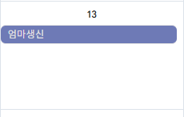

- UI
    - 공통
        - 전체적으로 텍스트의 굵기를 크게하고, 폰트를 동글동글하며 귀여운 폰트로 변경
    - 목표 활동기록 페이지
        - 목표,활동기록 추가하는 페이지를 각각 만들어서 라우팅하고, 기존에 있던 페이지에서는 추가된 목표,오늘자 추가된 활동기록만 보이도록 수정정
        - 큰 카드 UI내부 안에서 각각의 카드 UI를 사용하지말아라.
    - 사이드 메뉴
        - 각 메뉴앞에는 메뉴와 알맞는 아이콘을 배치
        - 메뉴를 클릭하여 해당 메뉴로 이동할때는 부드럽게 전환되는 애니메이션 추가
    - 캘린더
        - 캘린더의 바깥 테두리를 좀더 명확하게 보이도록 변경
        - 없는 날짜의 UI를 밝은색으로 변경
        - 날짜셀에 여러 개의 목표색상을 표시 가능하도록, 목표색상이 전체 셀의 색을 변경하는 것이 아니라 아래 이미지처럼 셀 안에 개별 라벨(둥근 색상 블록)로 표시되도록 수정

          